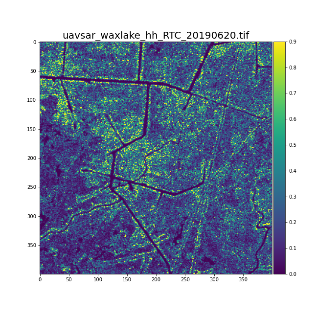
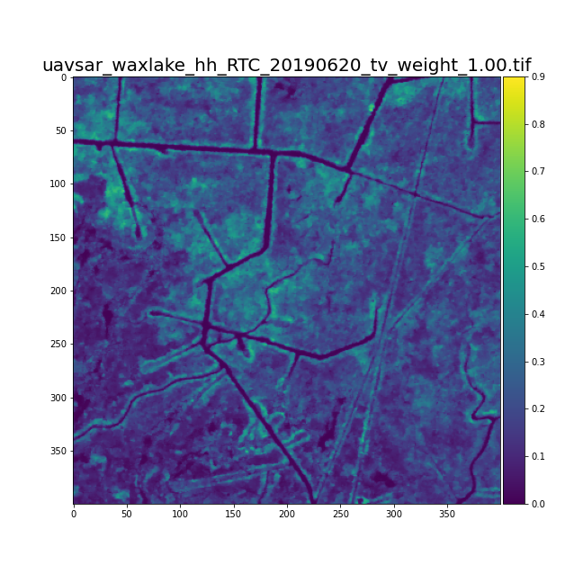
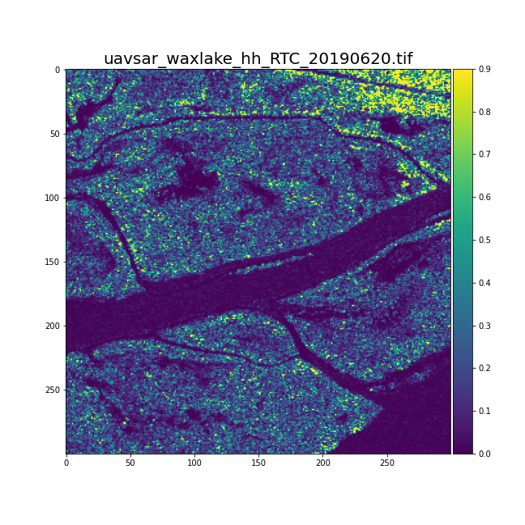
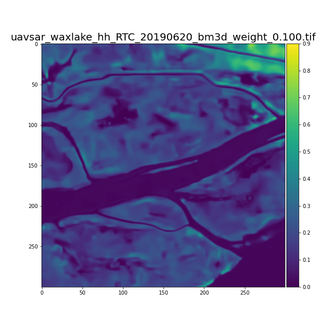

# Rabasar 

This is a python implementation of Ratio-Based Multitemporal SAR Images Denoising from the [RABASAR](https://hal.archives-ouvertes.fr/hal-01791355/) paper. RABASAR is application of the so-called [plug-and-play denoisers](https://arxiv.org/abs/1605.01710) for SAR image de-speckling to a temporal stack of intensity images. 

## Examples

These are subsets of UAVSAR over the Wax Lake Delta. They are HH polarized images in linear units.

### Total Variation

### BM3D

## Objectives

We have two primary goals in this repository:

1. to explore the RABASAR methodology in python including a detailed comparison of related spatial denoising techniques.
2. to apply the RABASAR methodology to open L-band images from UAVSAR and ALOS-1 in preparation for NISAR. 

Because we are testing this methodology on larger areas and with two different sensors, the [notebooks](notebooks/) are predominantly dedicated to reprojecting the open imagery into a datacube, inspecting/testing algorithms to determine de-speckling parameters, saving the output products so we can later inspect them, etc. As such, we expect this code to be picked apart and improved as needed for specific SAR applications.

# Installation

The installations are based on python 3.7+ using anaconda and conda within a virtual environment. Generally, this is accomplished as follows:

1. Create a virtual environment using the `requirements.txt`
2. Install rabasar downloading this repo and `pip install .`

More explicitly, using the anaconda distribution for Mac or Windows:

1. Navigate to the directory with this repository on your local machine. 
2. `conda create --name rabasar_env python=3.7`
3. `conda activate rabasar_env`
4. `pip install -r requirements.txt`
5. `pip install .` 
    
5. Ensure your python can be found by jupyter via `python -m ipykernel install --user`

You can make sure your installation was done correctly running `python -c "import rabasar"` and/or running the notebooks. At some point, we may distribute on `pypi`, though would want more robust tests and simpler demonstrations. If there are problems with the pip distributions of the requirements alternatively, you can use conda via `conda install -c conda-forge --yes --file requirements.txt`.

## With Docker

This is mainly to ensure the binaries from `bm3d` can work with problematic mac environments. Clone this repository and navigate to on your local machine.

1. `docker build -f docker/Dockerfile -t rabasar .` (this ensures the build context is the same as this repository)
2. `docker run -ti -p 8888:8888 -v <path_to_local_repo>:/home/rabasar/notebooks rabasar` (make sure no jupyter notebooks are running with this port)
3. From the container, navigate to `/home/rabasar/notebooks` and then run `jupyter notebook --ip 0.0.0.0 --no-browser --allow-root`.
4. Copy the url with the token to your browser e.g. `localhost:8888/token...`.

## Known Issues

The [`bm3d`](http://www.cs.tut.fi/~foi/GCF-BM3D/), installed with `pip`, may kill the python interpreter without explanation. We did not have any issues with the `tv` regularizer.

# References

### Rabasar
+ Zhao, et al. [RABASAR](https://hal.archives-ouvertes.fr/hal-01791355/), 2019.
+ Zhao, et al. [Github Repo](https://github.com/WeiyingZhao/Multitemporal-SAR-image-denoising), 2019.
+ Zhao's [Thesis](https://perso.telecom-paristech.fr/tupin/PUB/PhDSu.pdf) - contains more numerical experiments and extensive background.

### Spatial Denoising
+  Bioucas-Dias and Figueiredo. [Multiplicative Noise Removal Using Variable
Splitting and Constrained Optimization](https://arxiv.org/pdf/0912.1845.pdf), 2010. Note this is a "special case" of the [Plug-and-Play ADMM](https://arxiv.org/abs/1605.01710) below. The regularizer here is TV.
+ Delladelle, et al. [MuLoG: Multi-channel Logarithm with Gaussian denoising](https://arxiv.org/abs/1704.05335), 2017.

### ADMM

+ Boyd, et al. [Distributed Optimization and Statistical
Learning via the Alternating Direction
Method of Multipliers](https://web.stanford.edu/~boyd/papers/pdf/admm_distr_stats.pdf), 2010.
+ Chan, et al. [Plug-and-Play ADMM for Image Restoration: Fixed Point Convergence and Applications](https://arxiv.org/abs/1605.01710), 2016. This is a general methodology for any regularizer and noise model such that each term satisfies a particular global criterion. This encompasses the Bioucas-Dias and Figueiredo method above.

# License

See [LICENSE.txt](LICENSE.txt).

>Copyright 2020, by the California Institute of Technology. ALL RIGHTS RESERVED. United States Government Sponsorship acknowledged. Any commercial use must be negotiated with the Office of Technology Transfer at the California Institute of Technology.

>This software may be subject to U.S. export control laws. By accepting this software, the user agrees to comply with all applicable U.S. export laws and regulations. User has the responsibility to obtain export licenses, or other export authority as may be required before exporting such information to foreign countries or providing access to foreign persons.